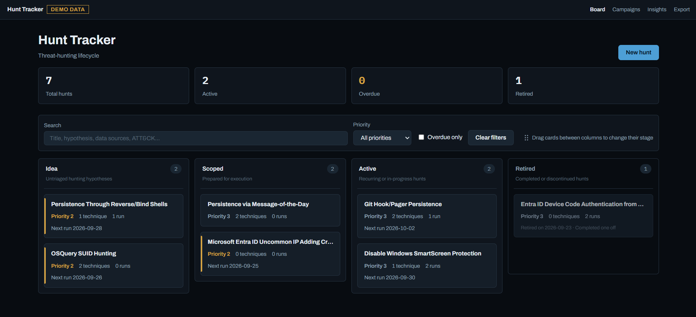
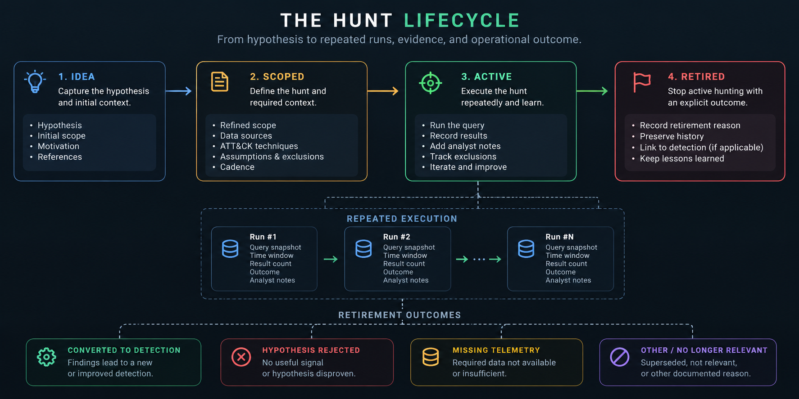
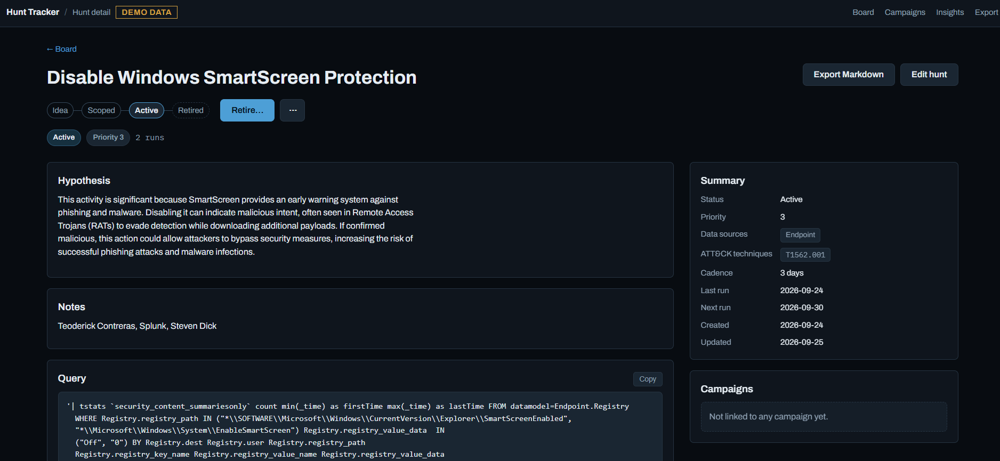
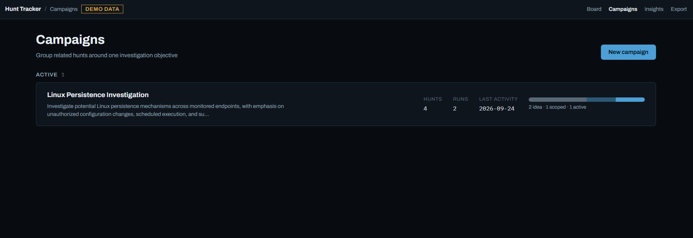

# Hunt Tracker

**A local-first workspace for managing the threat hunting lifecycle; from hypothesis to repeated runs, evidence, and operational outcome.**


> **Threat hunting is a lifecycle, not a folder of saved queries.**

<p align="center">
  
</p>

Hunt Tracker is a lightweight workspace for security analysts who want to manage threat hunts as a **repeatable operational process**, rather than a collection of saved queries scattered across spreadsheets, tickets, and notes.

Define a hypothesis, scope the hunt, preserve reproducible runs, track exclusions, organize related work into campaigns, and retire hunts with an explicit outcome.

---

## Why Hunt Tracker?

Most hunt programs quietly die in a spreadsheet or a notes app.

A hunt starts with a hypothesis. Then the query changes. It gets executed again. An exclusion is added. New telemetry becomes available. Nothing is found for three months. Or something *is* found and the hunt eventually becomes a detection.

The query is only one part of that history.

Hunt Tracker keeps the full lifecycle together so you can answer:

- **What are we hunting?**
- **Why does this hunt exist?**
- **When was it last executed?**
- **What query did we actually run at that point in time?**
- **What did we find?**
- **What exclusions or assumptions affected the results?**
- **Why was the hunt retired?**
- **Did it produce a detection, reveal a telemetry gap, or reject the original hypothesis?**

---

## The Hunt Lifecycle

<p align="center">
  
</p>

Hunts move through a deliberately simple lifecycle:

**Idea → Scoped → Active → Retired**

The status tells you where a hunt is today.

Its run history tells you **how it got there**.

An active hunt can be executed repeatedly while preserving each run independently. When the hunt is no longer useful as recurring hunting activity, it is retired with a reason instead of simply disappearing from the board.

Typical retirement outcomes include:

- Converted to detection
- Hypothesis rejected
- Missing or insufficient telemetry
- Superseded by another hunt
- No longer relevant
- Other documented operational reason

---


## See It in Action

### Organize hunting work

<p align="center">
  
</p>

The board provides a simple view of the hunting pipeline across **Idea, Scoped, Active, and Retired** hunts.

Priority, cadence, ATT&CK context, run activity, and overdue state remain visible without turning the application into another ticketing system.

---

### Preserve every execution

<p align="center">
  
</p>

Each hunt keeps its hypothesis, query, metadata, exclusions, and execution history together.

Runs are stored independently so previous executions remain reproducible even as the hunt evolves.

---

### Group related hunts into campaigns

<p align="center">
  
</p>

Campaigns group hunts around a broader investigation, threat scenario, technology, or security objective without changing the lifecycle of the individual hunts.

---

### Understand the hunting program

<p align="center">
  
</p>

Insights provide a lightweight view into hunting activity, lifecycle distribution, run outcomes, retirement reasons, and how the program evolves over time.

---

## Features

### Hunt Management

- Hunt lifecycle: Idea, Scoped, Active, Retired
- Hypotheses and hunting context
- Priority and cadence
- Data-source tracking
- MITRE ATT&CK techniques
- Overdue-hunt visibility
- Explicit retirement reasons

### Reproducible Runs

- Immutable run history
- Query snapshots
- Search windows
- Result counts
- Run outcomes
- Analyst notes
- Reverse-chronological execution history

### Hunting Context

- Active exclusions
- Campaigns
- Hunt metadata
- Search and filtering
- Lifecycle and activity insights

### Export & Backup

- Full JSON export
- SQLite backup
- Portable local data

### Demo Mode

- Dedicated demo database
- Separate runtime configuration
- Visible demo-mode indicator

---

## Quick start

### Requirements

- Python 3.11+
- Git

### Windows (PowerShell)

```powershell
git clone https://github.com/glikoaop0/hunt-tracker.git
cd hunt-tracker
python -m venv .venv
.\.venv\Scripts\Activate.ps1
pip install -r requirements.txt
python -m uvicorn app.main:app --reload
```

### macOS / Linux

```bash
git clone https://github.com/glikoaop0/hunt-tracker.git
cd hunt-tracker
python -m venv .venv
source .venv/bin/activate
pip install -r requirements.txt
python -m uvicorn app.main:app --reload
```

Then open **http://127.0.0.1:8000**. The app creates its database on first start, and the board starts empty.

Next time, you only need to activate the virtual environment and run the last command.


## Demo mode

Want to take screenshots or record a demo without exposing your real hunts? Demo mode uses a separate database and shows a **DEMO DATA** badge in the top bar.

```powershell
# Windows (PowerShell)
$env:HUNT_TRACKER_DB = "demo"; python -m uvicorn app.main:app --reload --port 8001
```

```bash
# macOS / Linux
HUNT_TRACKER_DB=demo python -m uvicorn app.main:app --reload --port 8001
```

Demo mode opens on **http://127.0.0.1:8001** and never touches your real data.


## Data and backups

All data lives in a single SQLite file in the project root: `hunts.db` (or `demo.db` in demo mode). Database files and the `backups/` folder are git-ignored.

- **Backup anytime** from the Export page (`/export`).
- **After updating** to a version with schema changes, run:

  ```
  python -m app.migrate
  ```

  It backs up your database to `backups/` first, then adds any missing tables and columns. Safe to run repeatedly.

---

## Architecture

Hunt Tracker deliberately uses a small local architecture.

```text
┌─────────────────────────────┐
│       Jinja2 + HTMX         │
│            UI               │
└──────────────┬──────────────┘
               │
               ▼
┌─────────────────────────────┐
│          FastAPI            │
│     Routes / Validation     │
└──────────────┬──────────────┘
               │
               ▼
┌─────────────────────────────┐
│       Domain / Service      │
│            Logic            │
└──────────────┬──────────────┘
               │
               ▼
┌─────────────────────────────┐
│           SQLite            │
│       Local Hunt Data       │
└─────────────────────────────┘
```

### Stack

- **FastAPI** : backend and routing
- **Jinja2** : server-rendered templates
- **HTMX** : targeted UI interactions
- **SQLite** : local persistence
- **Pytest** : automated testing


---


## Security

Hunt Tracker is a **single-user app meant to run on your own machine**, bound to `127.0.0.1`. It has **no authentication**: anyone who can reach the port can read and change everything.

**Do not** expose it on a network (e.g. `--host 0.0.0.0`), put it behind a public reverse proxy, or run it on a shared server.

Built-in protections include CSRF protection on every change, sanitized Markdown rendering. Your database, backups and exports contain your hunts, queries and exclusions in plain text, so treat them like any other investigation data.

See [SECURITY.md](SECURITY.md) for the threat model, known limitations, and how to report a vulnerability.

## Non-goals

Hunt Tracker is deliberately small. It does not include, and doesn't plan to include:

- Authentication or multi-user accounts
- SIEM, EDR or API integrations: queries are stored and copied, never executed
- File uploads or attachments
- A rich-text editor (notes are Markdown)
- Background jobs or deployment configuration

## Roadmap

Ideas being considered for future versions:

- Realistic demo dataset based on public ATT&CK techniques
- ATT&CK Navigator layer export (coverage by status and last run)
- Telemetry gap report built from "missing telemetry" retirements
- Sigma rule stub when a hunt is retired as "converted to detection"
- Query versioning with diffs

The goal is not to turn Hunt Tracker into a SIEM or SOAR.

New features should strengthen the core workflow:

> **Capture better hunts, execute them reproducibly, learn from them, and preserve the outcome.**

Suggestions are welcome: open an issue.

## Running the tests

With the virtual environment active:

```
python -m pytest
```

Tests run against an in-memory database and never touch your real data.


## Contributing

Issues and pull requests are welcome. For anything bigger than a small fix, please open an issue first to discuss the idea. Run the test suite before submitting.

## Credits

Built and maintained by [glikoaop0](https://github.com/glikoaop0).

Vendored components:

- [HTMX](https://htmx.org) 2.0.10 (0BSD)
- Archivo font (SIL Open Font License 1.1)
- IBM Plex Mono font (SIL Open Font License 1.1)


## License

No license has been chosen yet

---

<p align="center">
  <strong>Hunt deliberately. Preserve the evidence. Learn from every run.</strong>
</p>

